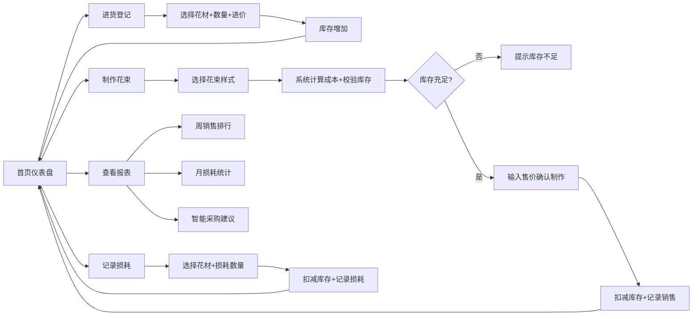

## 1. 产品概述

小型鲜花店花材库存与花束制作管理工具，帮助店主管理进货、制作花束、记录损耗，并通过数据分析优化采购决策。
- 主要解决：花材库存混乱、成本核算不清、损耗无法量化、热销品/高损耗品缺乏数据支撑的问题
- 目标用户：小型鲜花店店主/店员，无需专业技术背景

## 2. 核心功能

### 2.1 用户角色
| 角色 | 注册方式 | 核心权限 |
|------|----------|----------|
| 店主/店员 | 无需注册，本地直接使用 | 所有功能：进货、制作花束、记录损耗、查看报表 |

### 2.2 功能模块
1. **首页仪表盘**：库存概览、今日操作快捷入口、低库存预警
2. **花材库存管理**：花材列表、进货登记、库存查看
3. **花束制作中心**：花束样式选择、成本计算、利润预览、库存扣减
4. **损耗记录**：每日损耗登记、损耗历史查看
5. **数据报表**：周销售排行、月损耗统计、趋势分析

### 2.3 页面详情
| 页面名称 | 模块名称 | 功能描述 |
|----------|----------|----------|
| 首页仪表盘 | 库存概览卡片 | 展示5种花材当前库存量、总库存价值，低库存标红预警 |
| 首页仪表盘 | 快捷操作区 | 进货、制作花束、记录损耗三个快捷入口按钮 |
| 首页仪表盘 | 今日摘要 | 今日制作花束数、今日损耗金额 |
| 花材库存 | 花材列表 | 玫瑰、百合、康乃馨、向日葵、洋桔梗的库存、进价、总价值 |
| 花材库存 | 进货登记弹窗 | 选择花材、输入进货数量、进价，确认后增加库存 |
| 花束制作 | 花束样式列表 | 预设花束样式卡片（如19朵红玫瑰、11朵混色等） |
| 花束制作 | 花束详情/成本计算 | 显示用花明细、总成本、建议售价、利润、库存充足状态 |
| 花束制作 | 确认制作 | 输入实际售价，确认后扣减对应花材库存，记录销售 |
| 损耗记录 | 损耗登记表单 | 选择花材、输入损耗数量、备注（可选），自动扣减库存 |
| 损耗记录 | 损耗历史列表 | 按日期展示损耗记录，可筛选花材种类 |
| 数据报表 | 周销售排行 | 柱状图展示本周各花材使用量/销售额排名 |
| 数据报表 | 月损耗统计 | 饼图展示本月各花材损耗金额占比、总损耗金额 |
| 数据报表 | 智能建议 | 根据数据提示"建议减少XX进货量"或"XX为热销花材" |

## 3. 核心流程

用户打开应用后在首页查看库存状态，日常使用流程包括：进货登记→制作花束（系统自动核算成本并校验库存）→每日结束记录损耗→每周/月底查看报表分析。

## 4. 用户界面设计

### 4.1 设计风格
- **主色调**：玫瑰粉 `#E8B4B8` 作为主色，搭配叶绿 `#7BA05B` 作为辅助色
- **中性色**：奶油米白 `#FDF8F5` 背景，深棕灰 `#4A4A4A` 文字
- **按钮风格**：圆角胶囊形按钮，柔和渐变，悬停时有轻微上浮阴影
- **字体**：标题用优雅衬线字体「Noto Serif SC」，正文用「Noto Sans SC」
- **布局风格**：卡片式布局，柔和圆角，微妙阴影，整体清新自然
- **图标风格**：lucide-react 线性图标，配合花朵emoji点缀

### 4.2 页面设计概述
| 页面名称 | 模块名称 | UI元素 |
|----------|----------|--------|
| 首页仪表盘 | 库存概览 | 5张横向排列的库存卡片，渐变背景色，数量大号字体，低库存时卡片边框红色闪烁 |
| 首页仪表盘 | 快捷操作 | 三个大尺寸圆角按钮，带图标，悬停上浮效果 |
| 首页仪表盘 | 今日摘要 | 简洁数据卡片，浅色背景 |
| 花材库存 | 花材列表 | 表格布局，每行一种花材，末尾有"进货"操作按钮 |
| 花束制作 | 样式列表 | 网格卡片布局，每张卡片显示花束图片、名称、用花数量、预估成本 |
| 花束制作 | 详情弹窗 | 左半部分花束信息，右半部分成本利润明细，底部确认按钮 |
| 损耗记录 | 登记表单 | 垂直表单布局，日期默认当天，花材下拉选择，数量输入 |
| 数据报表 | 图表区 | 两个并列的图表卡片，下方是文字建议区 |

### 4.3 响应式
- 桌面端优先设计（1280px+），主内容区最大宽度1200px居中
- 平板端（768px-1279px）：卡片自适应排列，表格可横向滚动
- 移动端（<768px）：单列布局，底部导航栏替代顶部导航

### 4.4 微交互动效
- 页面加载：卡片依次淡入上浮（stagger animation）
- 按钮悬停：轻微上浮 + 阴影加深，过渡150ms
- 库存警告：低库存卡片边框轻微呼吸闪烁动画
- 弹窗出现：缩放+淡入过渡
