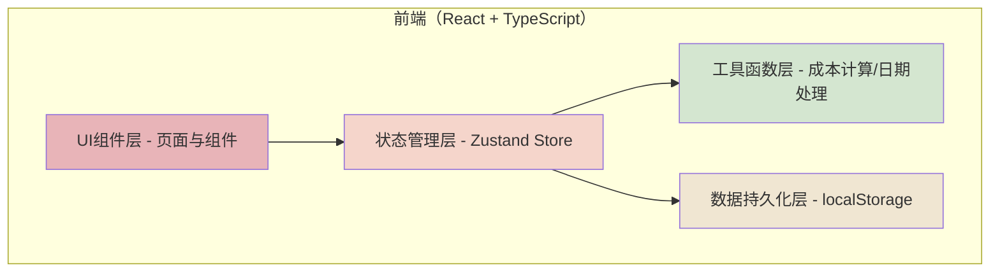
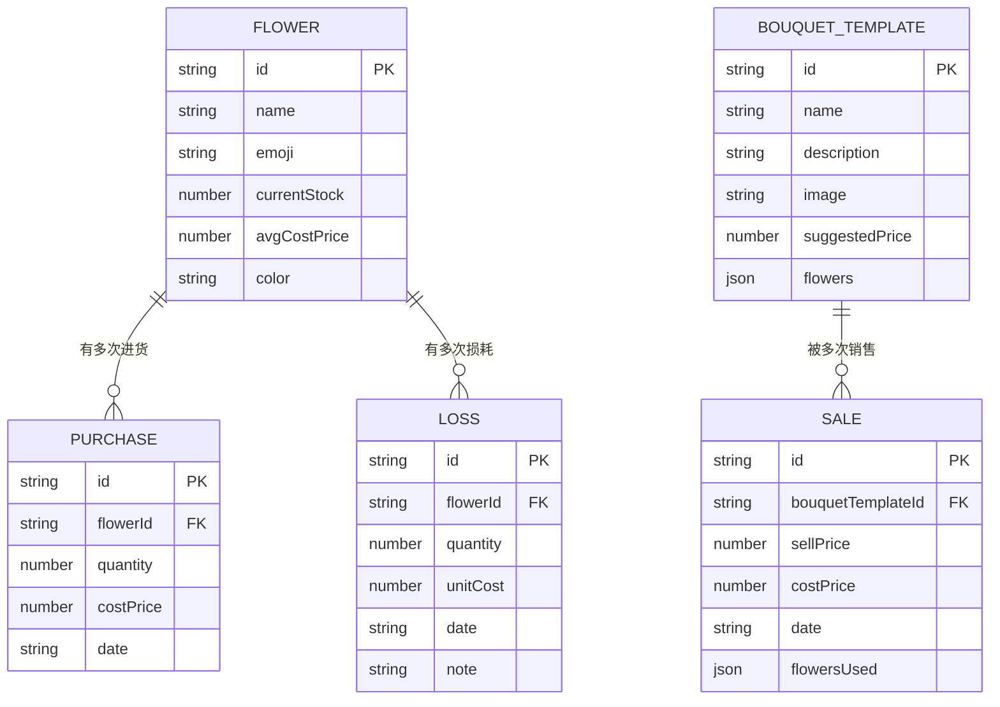

## 1. 架构设计

纯前端单页应用，无需后端服务。所有数据存储在浏览器 localStorage 中，刷新不丢失。

## 2. 技术描述
- **前端框架**：React@18 + TypeScript
- **构建工具**：Vite
- **样式方案**：Tailwind CSS@3
- **状态管理**：Zustand
- **路由管理**：React Router DOM
- **图标库**：lucide-react
- **图表库**：recharts（轻量级React图表库）
- **数据存储**：localStorage（无后端，纯前端持久化）
- **初始化模板**：react-ts（纯前端，包含react、react-router-dom、tailwind、zustand）

## 3. 路由定义
| 路由 | 页面组件 | 用途 |
|------|----------|------|
| / | Dashboard | 首页仪表盘，库存概览与快捷操作 |
| /inventory | Inventory | 花材库存管理 |
| /bouquet | BouquetMaker | 花束制作中心 |
| /loss | LossRecord | 损耗记录 |
| /reports | Reports | 数据报表分析 |

## 4. 数据模型

### 4.1 数据模型ER图

### 4.2 数据定义说明

**花材（Flower）**
- id: 唯一标识
- name: 花材名称（玫瑰、百合、康乃馨、向日葵、洋桔梗）
- emoji: 花材emoji图标
- currentStock: 当前库存（枝）
- avgCostPrice: 平均进价（元/枝）
- color: 展示颜色

**进货记录（Purchase）**
- id: 唯一标识
- flowerId: 关联花材ID
- quantity: 进货数量（枝）
- costPrice: 本次进价（元/枝）
- date: 进货日期（YYYY-MM-DD）

**花束模板（BouquetTemplate）**
- id: 唯一标识
- name: 花束名称
- description: 花束描述
- image: 花束配图（使用emoji组合）
- suggestedPrice: 建议售价
- flowers: 用花清单（如 [{flowerId: 'rose', quantity: 19}]）

**销售记录（Sale）**
- id: 唯一标识
- bouquetTemplateId: 关联花束模板ID
- sellPrice: 实际售价
- costPrice: 成本价
- date: 销售日期（YYYY-MM-DD）
- flowersUsed: 用花明细

**损耗记录（Loss）**
- id: 唯一标识
- flowerId: 关联花材ID
- quantity: 损耗数量
- unitCost: 损耗时的单位成本
- date: 损耗日期
- note: 备注（可选）

## 5. 状态管理设计

使用 Zustand 创建全局 Store，包含以下状态和方法：
- flowers: 花材列表及库存
- purchases: 进货记录
- bouquetTemplates: 花束模板
- sales: 销售记录
- losses: 损耗记录
- addPurchase(): 登记进货，更新库存和平均进价
- makeBouquet(): 制作花束，校验库存充足性，扣减库存，记录销售
- addLoss(): 记录损耗，扣减库存
- getWeeklySales(): 计算本周销售排行数据
- getMonthlyLoss(): 计算本月损耗统计数据

## 6. 初始化数据

系统预置以下基础数据：
1. 5种花材：玫瑰🌹、百合⚜️、康乃馨🌷、向日葵🌻、洋桔梗💐，初始库存均为0
2. 5-6种花束模板：如"19朵红玫瑰"、"11朵混色花束"、"向日葵毕业花束"等
